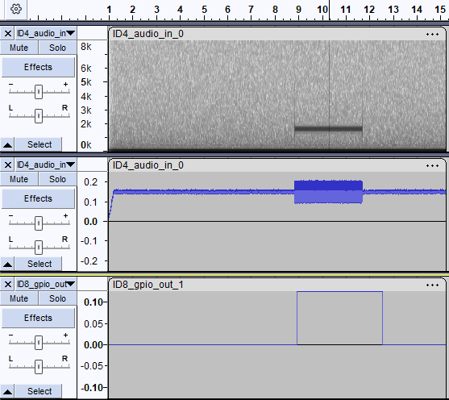

# NanoGraph for windows computers

The project files are located in the **“MSVC2022”** folder, which contains configurations for both 32-bit and 64-bit executables (the CMake project is currently under development).

Depending on the target architecture, the macro **PLATFORM_ARCH_32BIT** or **PLATFORM_ARCH_64BIT** must be enabled accordingly in the file **“top_manifest.h”** (comment/uncomment as appropriate).

The processing chain consists of a cascade combining a filter and a signal activity detector, as described in the graph scenario file:
 **“graph/graph_computer_filter_detector.txt”**. This graph is compiled by launching "NanoGraph_compile.bat", the result is  "graph_computer_filter_detector_bin.txt" used by NanoGraph_interpreter.

This graph is interpreted from the address returned by the function **get_graph_address()**, defined in **“top_manifest.c”**.

The graph reads input data from platform ID-4 (**“audio-in-0”**), which is connected to the file:
 **“./test/ID4_audio_in_0.raw”** (a sine wave burst in white noise with a strong DC offset).

The detection result is written to ID-8 (**“gpio-1”**). The GPIO is updated after each detector frame computation (frame size: 32 samples).

The graph is compiled using the command file:
 **“NanoGraph_compile.bat”**.

